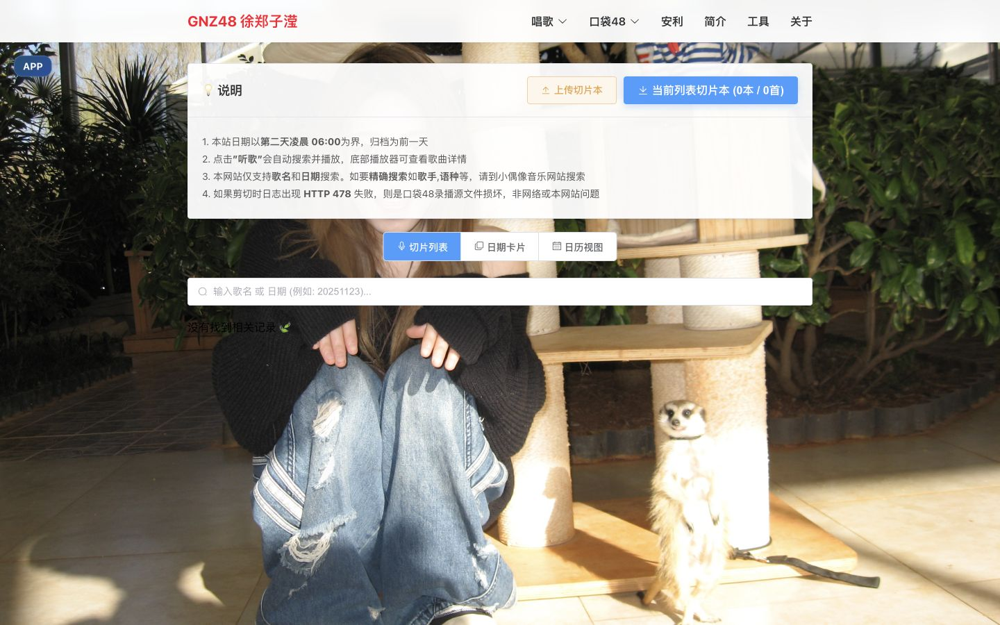
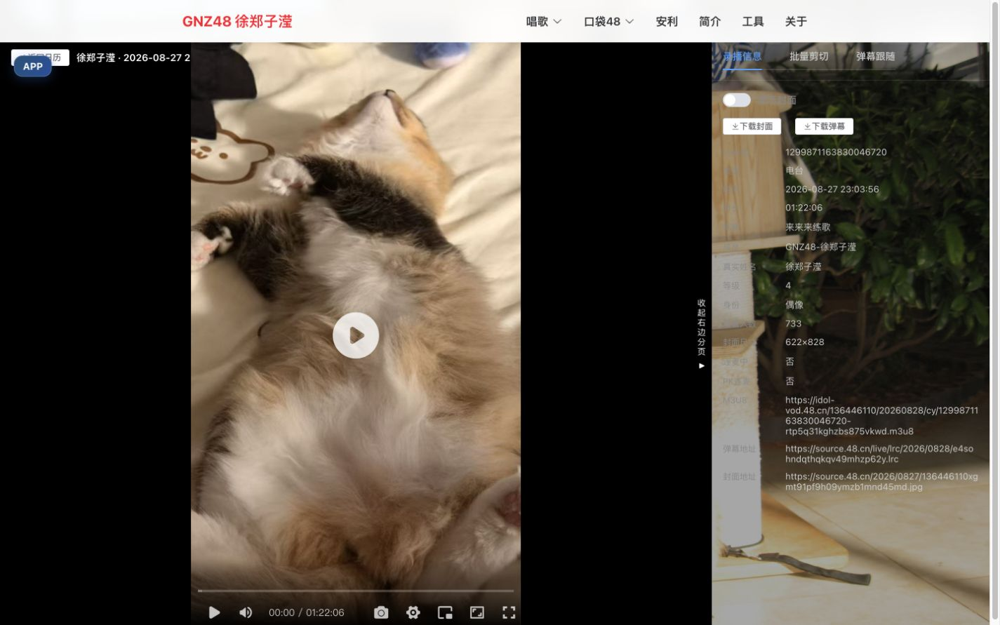
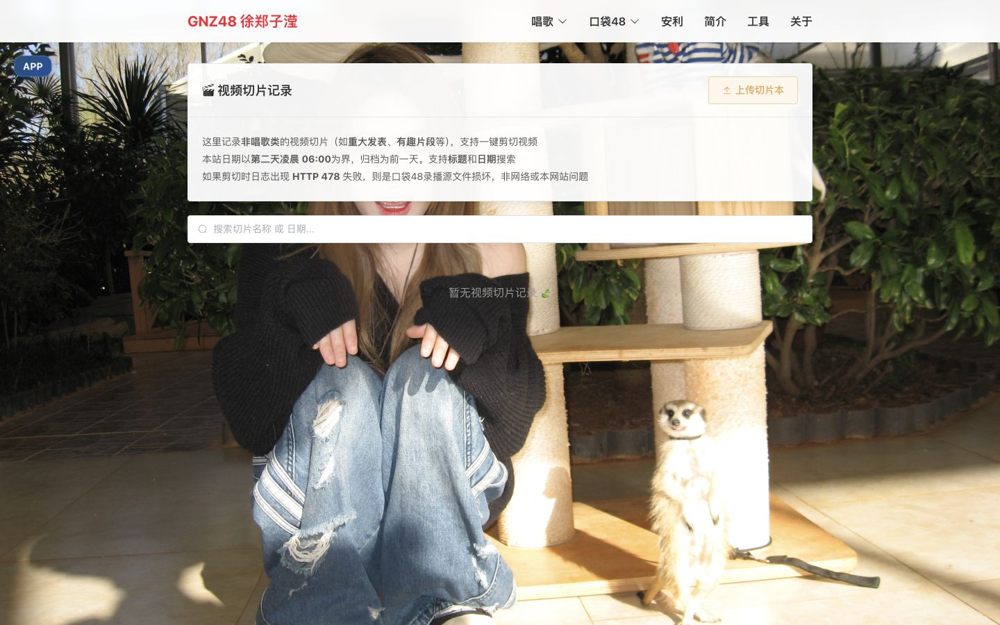
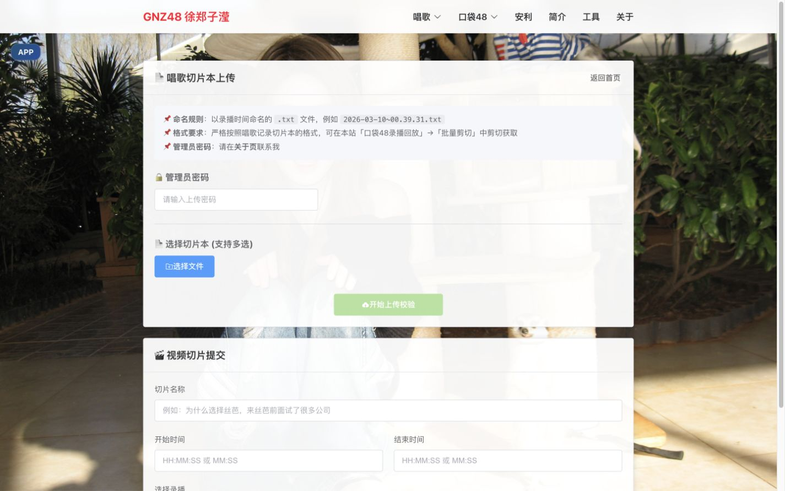
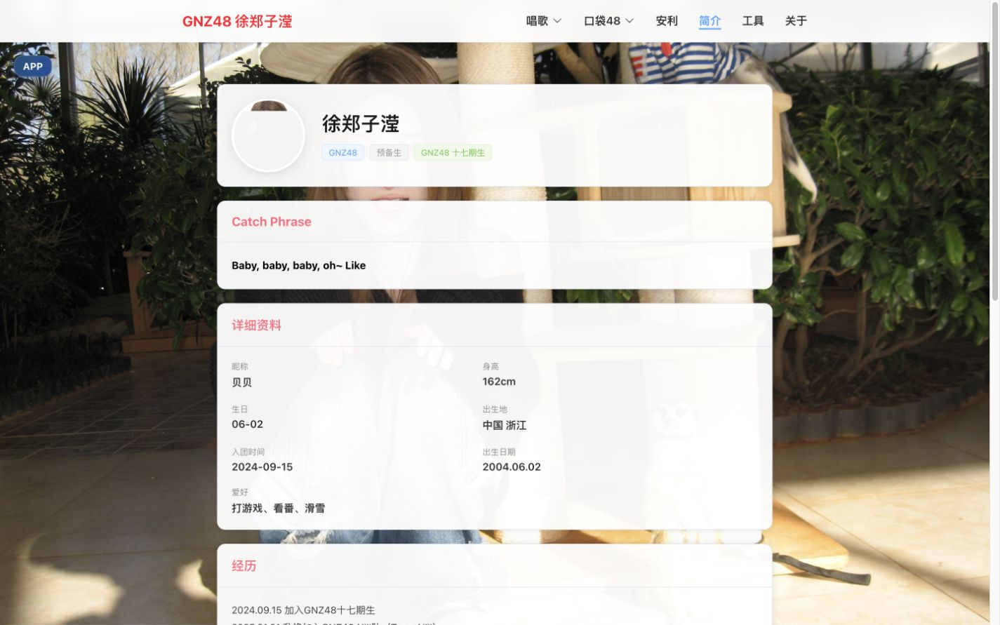
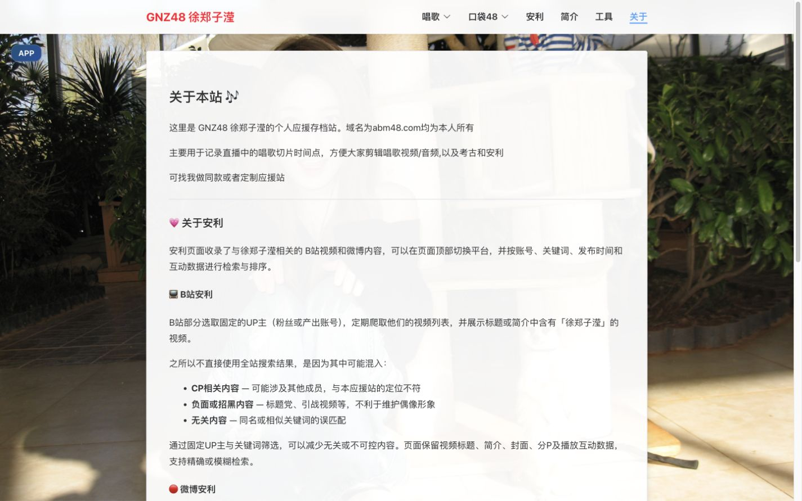

# GNZ48 徐郑子滢应援存档站

<p align="center">
  <a href="https://xzzy.abm48.com/">
    
  </a>
  <a href="https://tools.abm48.com/">
    
  </a>
</p>

这是为 **GNZ48 成员徐郑子滢** 建立的个人应援存档站，集中整理直播唱歌切片、非唱歌类视频切片、口袋48录播、B站与微博安利内容以及成员资料。本项目以 [tsh-fansite](https://github.com/30466/tsh-fansite) 为基础，根据成员信息、数据源、筛选规则、样式和页面内容进行小范围适配。

网站同时支持 PWA，可通过兼容浏览器安装到手机主屏幕或电脑桌面。

## 页面预览

### 唱歌切片与口袋48

| 唱歌切片列表 | 口袋48录播回放 |
| :---: | :---: |
|  |  |

| 视频切片记录 | 切片本与视频切片上传 |
| :---: | :---: |
|  |  |

### 安利

| B站安利 | 微博安利 |
| :---: | :---: |
|  |  |

### 资料与说明

| 成员简介 | 关于本站 |
| :---: | :---: |
|  |  |

## 页面与功能

### 唱歌切片记录 `/`

- 从唱歌切片本生成可检索的歌曲归档，支持按歌名或日期搜索。
- 提供切片列表、日期卡片和日历三种浏览方式；README 仅展示主要的切片列表界面。
- 支持查看或下载原始切片本，并将当前筛选结果批量打包为 ZIP。
- “听歌”会搜索 [小偶像音乐网站](https://abm48.com/) 中的歌曲，并通过全局迷你播放器播放。
- “一键剪切”可按记录的起止时间从对应口袋48录播中生成视频或音频，支持选择输出格式、下载并发和弹幕压制。

### 口袋48录播回放 `/replay`

- 从口袋48接口读取徐郑子滢的录播记录，以次日 `06:00` 为日期归档边界。
- 日历支持年月选择、上月/下月、最早/最新跳转和按需加载全部录播。
- 选择录播后进入播放器与信息面板的分栏界面，使用 ArtPlayer 和 hls.js 播放 HLS 视频。
- 支持口袋48 LRC 弹幕叠加、弹幕时间轴跟随、点击弹幕跳转播放位置。
- 右侧面板可查看录播详情、下载封面或弹幕，并导入切片本批量剪切。

### 视频切片记录 `/videoclip`

- 记录重大发表、有趣片段等非唱歌类视频切片。
- 支持按标题或日期检索，并根据录播时间和片段起止点一键剪切。
- 与唱歌切片共用 FFmpeg WebAssembly、TS 分片下载及可选弹幕压制能力。

### 安利 `/recommend`

页面默认显示 B站，可在顶部切换至微博。两个平台保持独立页面和业务逻辑，方便以后继续增加其他平台。

#### B站

- 从固定UP主列表中展示与徐郑子滢相关的视频。
- 所有收录UP主均按标题或简介中的“徐郑子滢”进行筛选，不设置免筛选账号。
- 支持账号筛选、精确/模糊检索、热门词、发布时间及播放互动数据排序。
- 搜索范围包括标题、简介和分P标题；命中分P时可直接跳转到对应分P。

#### 微博

- 展示徐郑子滢本人、官方账号以及粉丝产出和资料账号的微博。
- `GNZ48-徐郑子滢`、`爱吃抹茶味的贝果酱` 单独位于第一行并全量保留，其他账号按“徐郑子滢超话”筛选。
- 支持正文、转发原文和用户搜索，以及发布时间、点赞、评论和转发排序。
- 热门检索侧重返图、直拍、focus、搬运、抖音、小红书和口袋等微博常见内容。

### 成员简介 `/profile`

- 通过 [abm48.com](https://abm48.com/) 的公开接口加载成员资料。
- 展示头像、团体与队伍、期数、Catch Phrase、详细资料、经历和总选排名。
- 支持全身照、历史队服照和公式照预览，并提供成员档案网站与 APP 入口。

### 上传后台 `/upload`

- 管理员可批量上传唱歌切片本，由服务端校验并更新数据。
- 支持填写名称、起止时间并选择口袋48录播，提交非唱歌类视频切片记录。
- 上传接口为 `/upload.php`，本地开发时默认代理到 `http://localhost:8080`。

### 关于 `/about`

- 说明网站用途、B站与微博安利数据的收录和筛选方式。
- 提供维护者联系方式、个人主页以及同类应援站定制说明。

## 全局能力

- **迷你音乐播放器**：单例播放状态，支持上一首、下一首、暂停、列表循环、单曲循环和随机播放。
- **浏览器端剪切**：按目标时间范围下载 HLS TS 分片，在浏览器内通过 FFmpeg WASM 剪切，无需先下载完整录播。
- **弹幕压制**：视频剪切时可将口袋48弹幕渲染进画面，支持显示时长、最大数量和编码预设。
- **APP 入口**：所有页面提供浮动入口，展示 PWA 安装说明。
- **响应式布局**：导航、日历、播放器、筛选栏和卡片列表均适配移动端。

## 技术栈

- Vue 3 Composition API
- Vue Router 4
- Vite 7
- Element Plus
- ArtPlayer、hls.js、artplayer-plugin-danmuku
- `@ffmpeg/ffmpeg`、`@ffmpeg/util`
- JSZip
- vite-plugin-pwa

## 项目结构

```text
src/
├── api/                    # 口袋48请求与代理地址处理
├── components/             # 播放器、录播日历、弹幕、剪切和全局浮层
├── composables/            # 音乐播放、录播数据、FFmpeg、弹幕压制逻辑
├── utils/                  # LRC弹幕解析等工具
├── views/
│   ├── Home.vue            # 唱歌切片记录
│   ├── Replay.vue          # 录播日历与播放器
│   ├── VideoClip.vue       # 非唱歌类视频切片
│   ├── Recommend.vue       # 安利平台切换
│   ├── Bilibili.vue        # 独立B站安利业务
│   ├── Weibo.vue           # 独立微博安利业务
│   ├── Profile.vue         # 成员简介
│   ├── Upload.vue          # 上传后台
│   └── About.vue           # 关于本站
├── App.vue                 # 全局导航、播放器和浮动入口
└── router/index.js         # 页面路由

scripts/
├── gen-data.js             # 根据本地切片源数据生成前端 JSON
├── merge-bilibili.js       # 合并 bili-core 抓取的 B 站数据
├── merge-weibo.js          # 合并 weibo-core 抓取的微博数据
├── generate-icons.py       # 根据背景图生成 PWA 图标
└── txt_source/             # 唱歌切片源数据（本地维护）
```

## 数据

前端使用的主要数据文件位于 `public/data/`：

| 文件 | 用途 |
|---|---|
| `songs.json` | 唱歌切片记录 |
| `videoclips.json` | 非唱歌类视频切片记录 |
| `bilibili-merged.json` | 合并并筛选后的B站视频 |
| `weibo-merged.json` | 合并并筛选后的微博 |

抓取原始数据和生成后的 JSON 不提交到 Git；`scripts/merge-bilibili.js` 和 `scripts/merge-weibo.js` 是本项目用于合并爬虫项目数据的脚本，已纳入 Git，分别从本地 core 项目读取抓取结果并生成前端 JSON。脚本中的 `bili-core`、`weibo-core` 路径是维护者本机路径，其他使用者需要按自己的目录结构修改。

### 数据来源与开源协议

- [bili-core](https://github.com/30466/bili-core)：负责 B 站视频列表、视频详情、分 P 和合集元数据的抓取与导出。
- [weibo-core](https://github.com/30466/weibo-core)：负责微博账号帖子、正文详情和媒体元数据的抓取与导出。

如果使用、修改、分发这两个项目的代码或上述抓取、导出功能，需要分别遵循它们的 **GNU Affero General Public License v3.0 or later（AGPL-3.0-or-later）**，保留版权、许可证和来源说明，并按许可证要求提供相应源码。完整条款请分别查看两个项目仓库中的 `LICENSE` 文件。

其他动态数据来自：

- 口袋48 API：录播列表、录播详情、播放流、封面和弹幕。
- abm48.com API：成员资料、总选排名、歌曲搜索、歌曲详情和音频流。
- `/upload.php`：唱歌切片本与视频切片记录上传。

## 本地开发

```bash
npm install
npm run dev
```

生产构建：

```bash
npm run build
npm run preview
```

生成或同步本地数据：

```bash
npm run gen
npm run sync-bili
npm run sync-weibo
```

> `sync-bili` 和 `sync-weibo` 使用仓库中的合并脚本，并依赖本地 `bili-core`、`weibo-core` 的抓取数据目录；首次使用前请按上文说明修改脚本中的本机路径。生成的 `public/data/` 仍属于本地运行数据，不提交到 Git。

开发服务器代理：

| 前端路径 | 目标 | 用途 |
|---|---|---|
| `/pocketapi/*` | `pocketapi.48.cn` | 口袋48录播接口 |
| `/cdn/*` | `idol-vod.48.cn` | M3U8与TS视频分片 |
| `/source48/*` | `source.48.cn` | 封面与弹幕文件 |
| `/api/*` | `abm48.com` | 成员资料与音乐接口 |
| `/upload.php` | `localhost:8080` | 本地上传服务 |

## 剪切流程

```text
切片记录或用户导入的切片本
  → 查找对应口袋48录播
  → 获取并解析 M3U8
  → 计算覆盖目标时间的 TS 分片
  → 并发下载并在内存中拼接
  → FFmpeg WASM 无损流拷贝或回退重编码
  → 可选弹幕压制
  → 浏览器下载结果
```

如果录播源文件损坏，口袋48 CDN 可能返回 `HTTP 478`；这种情况不是用户网络或本站前端导致的。

## 核心实现逻辑

### 一键剪切与批量剪切

三个剪切入口共用同一底层流程：首页和视频切片页先根据记录定位对应录播，录播页则直接使用当前播放地址；批量剪切只是一次处理多组起止时间。

```text
定位录播并获取 M3U8
  → 解析并选择目标时间附近的 TS 分片
  → Worker Pool 并发下载并按原顺序拼接
  → FFmpeg WASM 精确剪切
  → 浏览器下载结果
```

每个 TS 分片最多重试 5 次。前两次使用 CDN 直连，后续通过 `Promise.any` 让直连与代理竞速。FFmpeg 优先尝试 `-c copy` 无损流拷贝，失败时视频回退到 `libx264 + AAC`，音频按目标格式重新编码；实例失效后会自动重建。

剪切时可以选择弹幕压制。系统解析口袋48 LRC 弹幕、缓存中文字体、按时间和轨道生成 `drawtext` 滤镜，再用 `libx264` 重编码；片段没有弹幕或弹幕处理失败时仍会继续普通剪切。

### 录播播放器

`ReplayPlayer.vue` 使用 ArtPlayer 和 hls.js。播放器先通过 `/cdn` 代理获取 M3U8 文本，再把其中的 TS 地址改写为 `idol-vod.48.cn` 直连地址并生成 Blob URL：

```text
代理获取 M3U8 → 重写 TS 地址 → hls.js 加载 Blob URL → CDN 直连播放分片
```

这样既能取得受来源限制的 M3U8，又不会让全部视频分片经过代理。播放器支持网络与媒体错误恢复、桌面/移动端不同控制项、滚动弹幕和弹幕时间轴跳转。选择录播后，右侧面板提供录播信息、批量剪切和弹幕跟随三个功能区。

### 录播数据与音乐播放器

录播列表首次只加载一页，需要时再翻页加载全部记录；`liveId` 用于去重，录播时间减去 6 小时后用于日期归档。`getLiveOne` 补充播放流、封面、弹幕和主播信息等完整字段，关键请求均带重试。

全局音乐播放器由模块级唯一 `Audio` 实例管理，搜索结果、底部播放条和详情面板共享播放列表与进度，支持列表循环、单曲循环、随机播放和错误自动跳过。

## 相关项目

- [本项目源代码](https://github.com/30466/xzzy-fansite)
- [Bilibili 抓取与导出工具 bili-core](https://github.com/30466/bili-core)
- [微博抓取与导出工具 weibo-core](https://github.com/30466/weibo-core)
- [徐郑子滢应援存档站](https://xzzy.abm48.com/)
- [小偶像音乐网站](https://abm48.com/)
- [个人工具站](https://tools.abm48.com/)
- [口袋48历史记录搜索](https://msg48.org/)

## 致谢

感谢徐郑子滢每天带来的动听歌声，也感谢持续整理录播、切片、返图和安利内容的各位老师。
